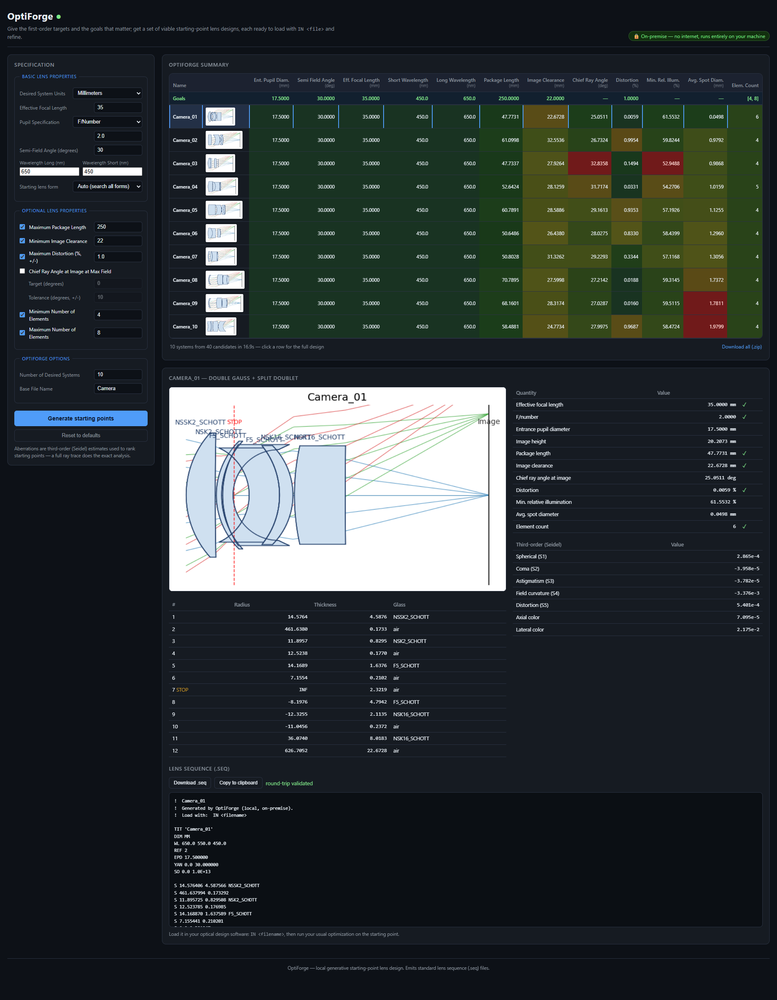

# OptiForge

A **generative starting-point lens design generator**.
Give a small set of specifications — focal length, pupil, field, waveband — plus the
goals that matter (package length, image clearance, distortion, chief ray angle,
element count) and it returns a **ranked set of viable first-pass lens designs**, each
as a standard lens-sequence (`.seq`) file ready for refinement.

It targets the earliest and often slowest stage of lens design: *creating the initial
lens form*. Instead of manually sketching a first lens, you get a table of optically
sensible starting points to choose from, in seconds.

- **Inputs:** units, EFL, pupil (F/# / EPD / NA), semi-field angle and wavelength range,
  plus optional goals that can each be switched on or off.
- **Outputs:** a summary table of candidate systems with a thumbnail and full
  performance row for each, plus a lens sequence (`.seq`) file per system.
- **Forms searched:** camera / double Gauss, Cooke triplet, telephoto, retrofocus
  (wide angle), Petzval (projector), collimator / projector, and microscope objectives.
- **On-premise:** runs entirely locally with **no internet** — suitable for secure /
  offline engineering environments.



> Not one answer, a *population*: the generator crosses classical forms with structural
> moves (add a field flattener, split a cemented doublet, drop an element, substitute
> glass) and randomised restarts, optimizes each against your goals, discards the
> unbuildable ones, and ranks what survives.

---

## Quickstart

### Web UI

```bash
python -m optiforge.webapp
# open http://127.0.0.1:5000   (set PORT to use another port)
```

Fill in the specification, press **Generate starting points**, and you get the summary
table. Every column sorts; cells are shaded by how they stand against the goal. Click a
row for the layout, the surface list, the third-order balance and the `.seq`.

### CLI — a set of starting points

```bash
python -m optiforge.cli --efl 35 --semi-field 30 --fno 2 --systems 10 \
    --base-name Camera --wl-short 450 --wl-long 650 \
    --max-package 250 --min-clearance 22 --max-distortion 1 \
    --min-elem 4 --max-elem 8 --layout
```

writes `Camera_01.seq` … `Camera_10.seq` plus `Camera_summary.txt`:

```text
        Name Ent.Pupil  SemiFld       EFL   Package  ImgClear  ChiefRay  Distort% RelIllum%   AvgSpot Elems
       Goals   17.5000  30.0000   35.0000  250.0000   22.0000         -    1.0000         -         - [4,8]
   Camera_01   17.5000  30.0000   35.0000   48.8623   22.0882   33.1863    0.0071   52.5296    0.0093     6
   Camera_02   17.5000  30.0000   35.0000   98.2434   26.0680   24.2377    0.9955   62.3603    0.9197     4
   ...
```

### CLI — a single starting point

```bash
python -m optiforge.cli --efl 50 --fov 40 --fno 2.8 --type double_gauss --out dg.seq --layout
python -m optiforge.cli --efl 120 --fov 20 --fno 4 --type telephoto --layout
python -m optiforge.cli --efl 1 --naf 0.25 --type microscope --obj-dist 1.0 --obj-height 0.1
```

Help: `python -m optiforge.cli --help`

### Loading a design

```text
IN Camera_01
```
then run your normal optimization on the starting point.

---

## The specification

**Basic properties** (always applied)

| Input | Meaning |
|---|---|
| Desired system units | mm / cm / inches — sets the `DIM` token and the units of every length |
| Effective focal length | held exactly, by homothetic normalization on every evaluation |
| Pupil specification | F/number, entrance pupil diameter, or numerical aperture |
| Semi-field angle | half the full field of view, in degrees |
| Wavelength range | long and short; drives the chromatic balance and the `WL` line |

**Optional goals** (each switched on independently)

| Goal | Effect |
|---|---|
| Maximum package length | front vertex to image plane |
| Minimum image clearance | last surface to image plane (back working distance) |
| Maximum distortion | third-order distortion at full field, ± % |
| Chief ray angle at image | target ± tolerance, for sensor CRA matching |
| Number of elements | min / max, filters and shapes the candidate population |

A goal that is switched off contributes nothing to the search or the ranking.

---

## How it works

1. **Specs** (`specs.py`) — normalize the aperture (EPD ↔ F/# ↔ NA), the field, and the
   waveband; collect the enabled goals.
2. **Candidate population** (`catalog.py` + `variants.py`) — pick the classical forms
   that suit the operating point, then cross them with structural moves:
   *field flattener*, *front corrector*, *split cemented doublet*, *drop the weakest
   group*, *glass substitution*, plus seeded randomised restarts that land the optimizer
   in genuinely different local minima.
3. **Goal-driven optimization** (`optimize.py`) — hold the target EFL exactly, then
   shape the lens to reduce third-order (Seidel) and chromatic aberration subject to
   one-sided penalties for each enabled goal and to manufacturability:
   minimum centre thickness, edge thickness and air space (all relative to the clear
   aperture), and no surface steeper than a hemisphere over its own beam.
4. **Metrics** (`metrics.py`) — every summary-table quantity: package length, image
   clearance, chief ray angle, distortion, relative illumination, field-averaged RMS
   spot diameter, element count, and a buildability ratio.
5. **Ranking** (`generator.py`) — score by goal violation first, then image quality
   (spot size in units of the diffraction limit), de-duplicate near-identical designs,
   and name the survivors `<Base>_01…NN`.
6. **Export** (`seqexport.py`) — write a standard `.seq` lens sequence.
7. **Validation** (`seqparse.py`) — round-trip the exported file and re-trace it to
   confirm EFL / F# / geometry.

### The optics engine (`optics.py`)
Pure-numpy paraxial ray tracing plus classical Seidel sums — S1 spherical, S2 coma,
S3 astigmatism, S4 Petzval, S5 distortion, and axial/lateral chromatic. The entrance
pupil is an object-space quantity, so the marginal ray enters at EPD/2 and the chief
ray passes through the centre of the stop. Glass dispersion is reconstructed from
(n<sub>d</sub>, V<sub>d</sub>) with a two-term Cauchy law so the *user's* waveband, not the
fixed F/d/C lines, drives the colour correction.

> The aberration figures are **third-order estimates** used to rank and screen starting
> points. A full ray-trace analysis is the next step - that is the point of the handoff.

### Output format
The exported `.seq` is plain-text sequence commands:
```
TIT 'Camera_01'
DIM MM
WL 650.0 550.0 450.0
REF 2
EPD 17.500000
YAN 0.0 30.000000
SO 0.0 1.0E+13
S 21.446309 5.984436 NSSK2_SCHOTT
...
STO
S -16.904445 30.490545
SI 0.0 0.0
GO
```
Finite conjugates (microscope) use `NAO` and `YOB` instead.

---

## Project layout

```
optiforge/
  specs.py       input specification + goal model
  catalog.py     classical starting-point library
  variants.py    structural moves that build the candidate population
  autotype.py    auto lens-form selection
  optics.py      paraxial + third-order engine
  metrics.py     summary-table metrics + buildability checks
  optimize.py    goal-aware merit-function optimizer (scipy)
  generator.py   generate() and generate_systems() orchestration
  seqexport.py   lens sequence (.seq) writer
  seqparse.py    .seq parser / round-trip validator
  report.py      text report, lens drawings, thumbnails, summary table
  cli.py         command-line interface
  webapp.py      local Flask UI
  templates/     web UI HTML
examples/        sample .seq + layout images per lens form
tests/           pytest suite
```

---

## Tests

```bash
python -m pytest tests/ -q
```

Covers aperture conversions, the paraxial/Seidel engine against a classic
double-Gauss prescription (entrance-pupil definition, chief ray through the stop, corrected
third-order balance), scale invariance, every structural move, the summary metrics,
buildability, `.seq` round-tripping, and the multi-system workflow — including that
switching a goal on actually steers the population.

---

### Notes
- All generated radii are in **radius mode** (the format default), so `S <radius> <thickness> <glass>`.
- Glass references are glass catalog strings (`NBK7_SCHOTT`, etc.).
- Relative illumination ignores clear-aperture vignetting, so treat it as an upper bound.
- A system that cannot meet every goal is still returned, flagged in the table — the
  search reports what it found rather than hiding it.
